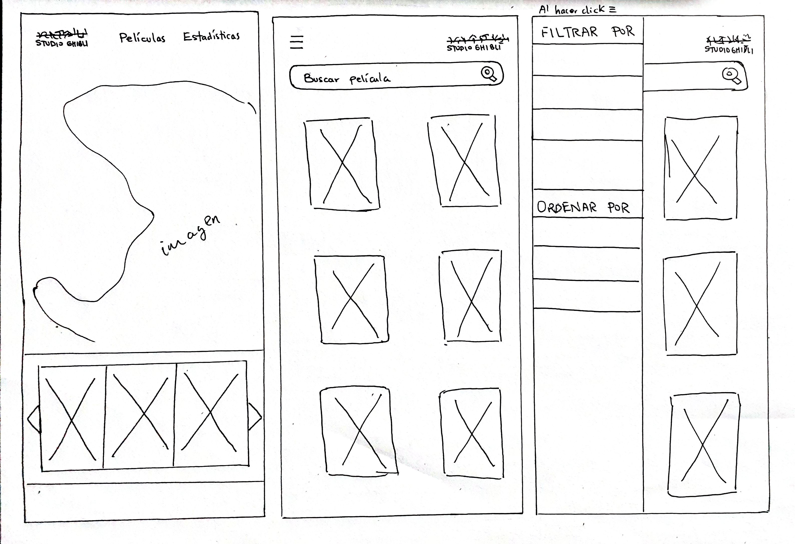
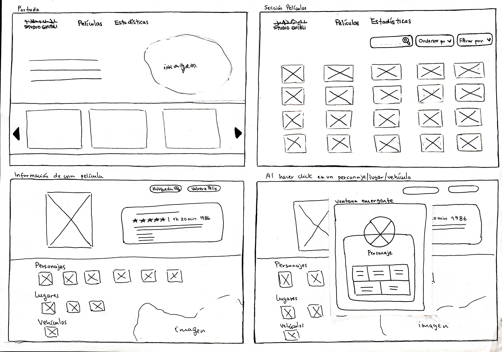
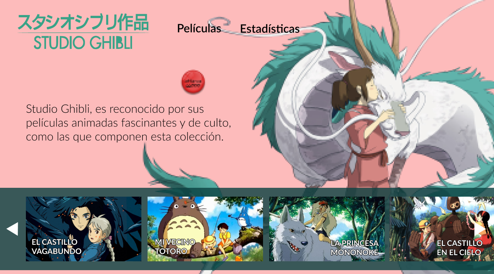
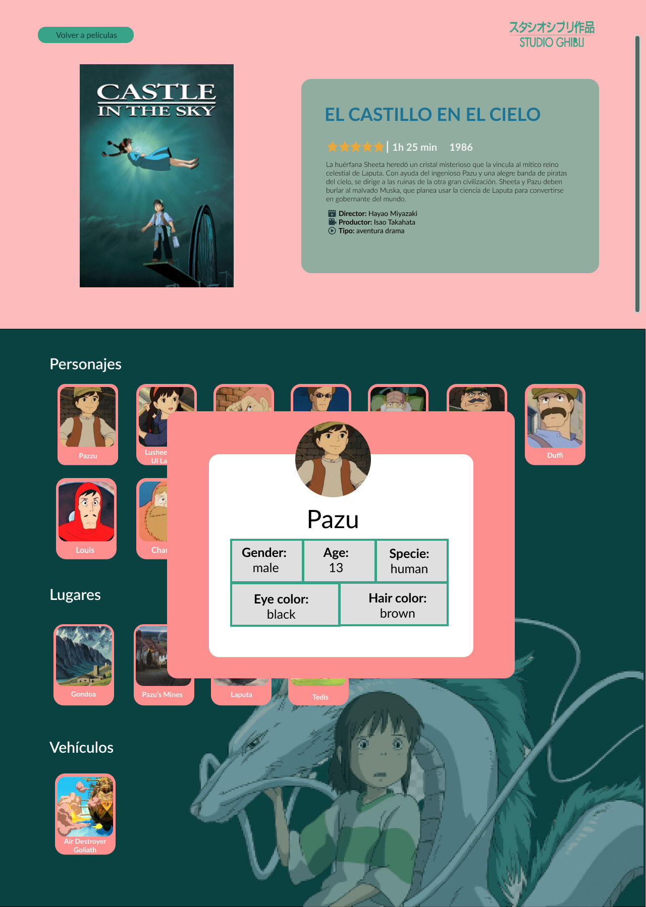
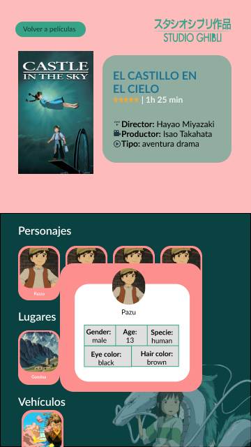

# Data Lovers – Studio Ghibli

## 1. Resumen del proyecto 📝

Este proyecto tiene como finalidad **construir una página web responsive**, dirigido a personas que les gusta el cine, en especial el animado, y quieren estar más informados sobre las películas de Studio Ghibli. Por lo que, se podrá `visualizar` de manera precisa y clara información de todas las películas, contando con información relevente como el año de su estreno, su descripción, el director, productor, personajes, locaciones y vehículos. Toda esta información puede ser manejada por los usuarios, de tal manera que puedan `filtrarla` y `ordenarla` según diversas especificaciones.

## 2. Descripción del proyecto 📎

### ¿Quiénes son los principales usuarios?
Desde fans del cine animado hasta adultos, jóvenes y niños que crecieron viendo la películas de Studio Ghibli, que no recuerdan el nombre específico de las peliculas para volverlas a ver o encontrar información detallada.
### ¿Cuáles son los objetivos de los usuarios en relación con esta página?
Que las personas de cualquier edad puedan acceder a la información detallada de las películas del Studio Ghibli.
### ¿Cómo esta página está resolviendo los problemas de los usuarios?
Filtrando, ordenando y buscando la información detallada de cada película según sus diversas necesidades de los usuarios.

### 2.1 Proceso Creativo de Diseño 👩🏻‍🎨🎨

* Estilo

Para el proyecto se optó por la temática de una de las películas de Studio Ghibli, El viaje de Chihiro, ya que vimos el buen contraste de colores que nos permitiría transmitir la información de forma clara y precisa, y que a su vez pueda ser amigable ante la vista de nuestros usuarios, asi ellos puedan tener un rápido reconocimiento de la interfaz de nuestra pagina web.

* Prototipo de baja fidelidad
Estos dos prototipos fueron realizados a mano para tener una idea de la estructura.

Esta sería la vista para celulares:

Esta sería la vista para desktop:

* Prototipo de alta fidelidad
Estos dos prototipos fueron realizados en Figma para aplicar los colores y temática previamente pensados.

Esta sería la vista para desktop:

Esta sería la vista para celulares:

